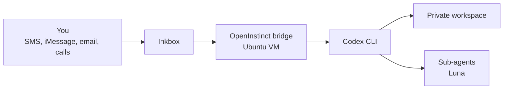

# OpenInstinct

Your own always-on Codex agent over SMS, iMessage, email, and calls.

Run it on a small Ubuntu VM, text it from anywhere, and let it work inside a persistent private workspace. Local installation also works, but the agent sleeps when your computer does.

## Architecture



The bridge keeps one Codex conversation per contact. Codex can use the shell, browser, files, web search, and messaging tools in the workspace.

## Install on a VM

Start with a clean Ubuntu 24.04 VM, then run:

```bash
curl -fsSL https://raw.githubusercontent.com/samagra14/openinstinct/main/install.sh | bash
```

There are two human checkpoints:

1. Sign in to Codex with the device code.
2. Create or connect the Inkbox identity in the setup wizard.

When setup finishes, text `START` to the new number. Then send a normal request.

## Install locally

Run the same command on Linux or macOS. Keep the computer awake while the agent is working.

## Defaults

- Main agent: `gpt-5.6-sol`
- Sub-agents: `gpt-5.6-luna`
- Routine work is auto-reviewed on the isolated machine
- Destructive, financial, account-security, and public-exposure actions still require approval
- Immediate SMS acknowledgment
- Long SMS replies are split into numbered parts
- Short, warm, plain-English replies
- Persistent browser profile and workspace
- Starts automatically after an Ubuntu VM reboot

## Useful commands

```bash
systemctl --user status openinstinct
systemctl --user restart openinstinct
journalctl --user -u openinstinct -f
CODEX_HOME="$HOME/.openinstinct/codex" \
INKBOX_CODEX_ENV_FILE="$HOME/.openinstinct/state/.env" \
inkbox-codex doctor
```

Text commands: `/status`, `/usage`, `/health`, `/stop`, `/new`, and `/resume`.

## Security

Use a dedicated VM. Do not expose the bridge port publicly. The default Inkbox tunnel is outbound-only, and Codex stays in a workspace-write sandbox.

Credentials live under `~/.openinstinct/` and `~/.inkbox-codex/`. They are never copied into this repository. Keep those directories private and enable MFA on the account used for Codex.

The broad auto-review policy is intended for an isolated personal-agent VM. Read [config/codex-config.toml](config/codex-config.toml) before using it on a shared machine.

## How this is packaged

This repository is a small deployment and configuration layer. It installs the official [Codex CLI](https://developers.openai.com/codex/cli), uses the documented [device login flow](https://learn.chatgpt.com/docs/auth#login-on-headless-devices), and sets the documented [sub-agent model default](https://learn.chatgpt.com/docs/agent-configuration/subagents#global-settings).

Messaging is provided by Inkbox through its hosted service and public Codex bridge. Those dependencies remain under their own terms. OpenInstinct pins a tested bridge revision and applies a small reliability overlay at install time rather than redistributing the bridge.

OpenInstinct is not affiliated with OpenAI, Inkbox, or Instinct.

## License

MIT
